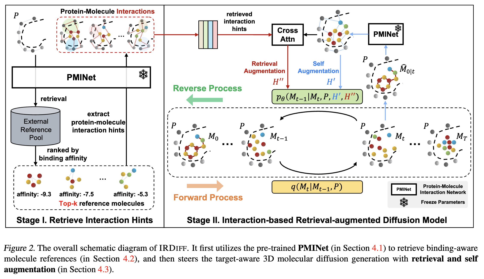
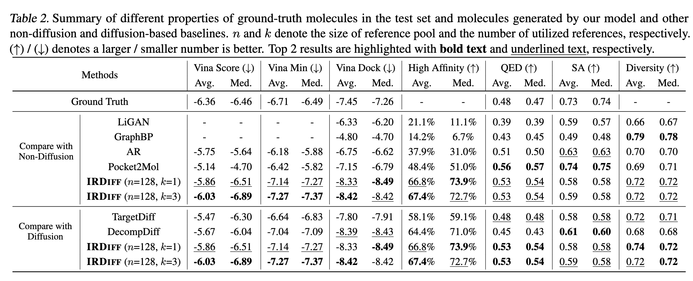

# Interaction-based Retrieval-augmented Diffusion Models for Protein-specific 3D Molecule Generation (ICML 2024)
Official implementation for our ICML 2024 paper - [Interaction-based Retrieval-augmented Diffusion Models for Protein-specific 3D Molecule Generation](https://openreview.net/forum?id=eejhD9FCP3).




### Environment

```shell
conda env create -f irdiff.yaml
conda activate irdiff
```

### Data and Preparation
The data preparation follows [IPDiff](https://openreview.net/forum?id=qH9nrMNTIW). For more details, please refer to [the repository of TargetDiff](https://github.com/guanjq/targetdiff?tab=readme-ov-file#data).

### ❗️❗️Path to the pre-trained PMINet and pre-trained IRDiff:

```shell
./pretrained_models
```

### ❗️❗️Path to the indices of retrieved prompts:

```shell
./src
```

### Training

```shell
conda activate irdiff
python train.py
```

### Sampling

```shell
python sample_split.py --start_index 0 --end_index 99 --batch_size 25
```

### Evaluation

```shell
python eval_split.py --eval_start_index 0 --eval_end_index 99
```

### Calculate metrics

```shell
python cal_metrics_from_pt.py
```


### Results


## Citation
```
@inproceedings{
    huang2024interactionbased,
    title={Interaction-based Retrieval-augmented Diffusion Models for Protein-specific 3D Molecule Generation},
    author={Zhilin Huang and Ling Yang and Xiangxin Zhou and Chujun Qin and Yijie Yu and Xiawu Zheng and Zikun Zhou and Wentao Zhang and Yu Wang and Wenming Yang},
    booktitle={International Conference on Machine Learning},
    year={2024},
}
```